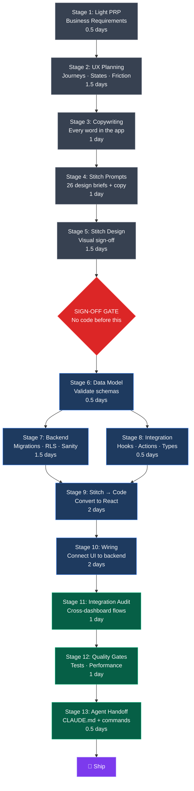
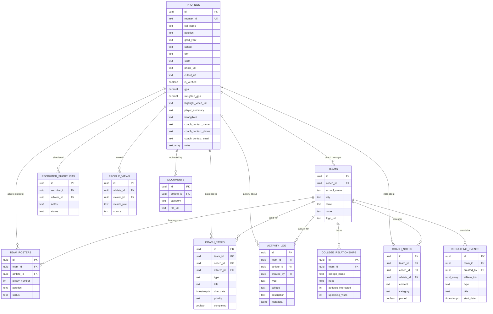
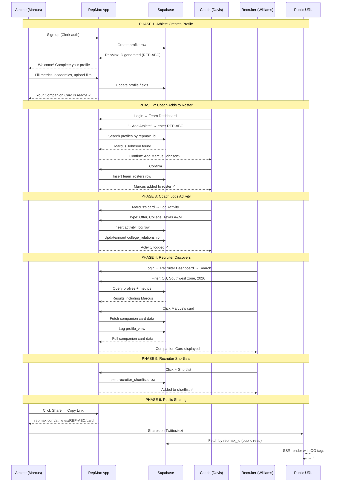
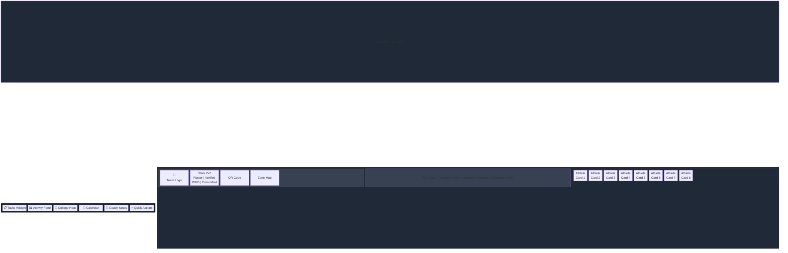
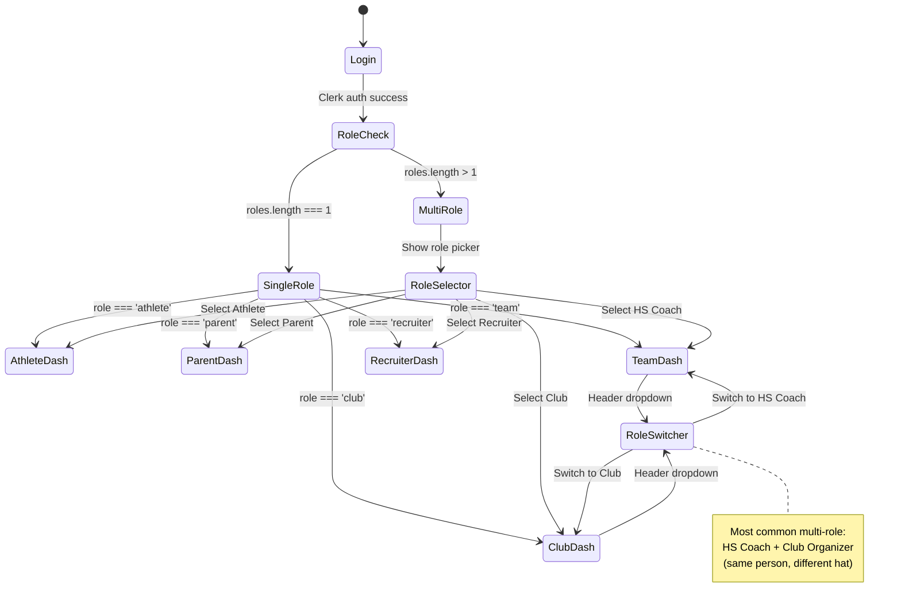
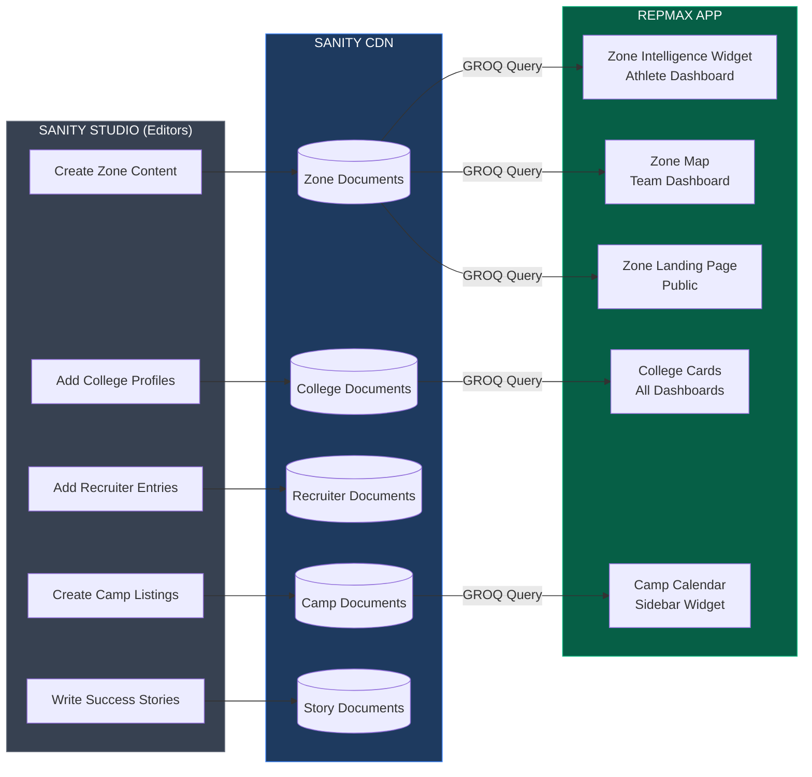
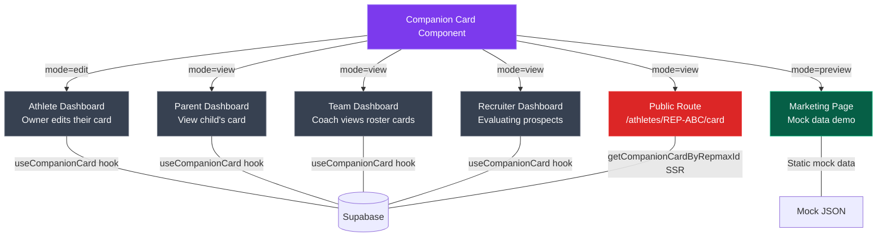

# RepMax v2 — Architecture Diagrams

## 1. Stitch Workflow Stage Flow

## 2. Entity Relationship Diagram

## 3. User Flow — Athlete Creates Profile → Coach Adds → Recruiter Finds

## 4. Dashboard Layout — Team Dashboard Grid

## 5. Multi-Role Switching Flow

## 6. Sanity CMS Content Flow

## 7. Companion Card Rendering Contexts

