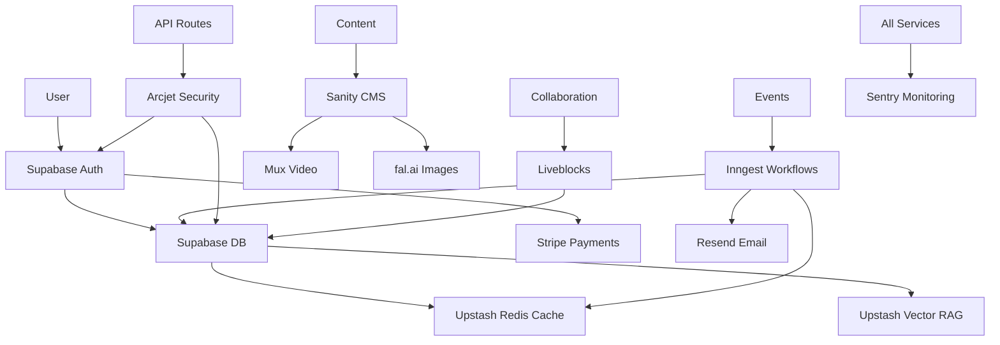

# Services Integration Matrix

**Last Updated:** 2025-10-21

This guide shows how all services in the AI Coder stack work together to build complete applications.

---

## Service Overview

| Service | Category | Primary Use | Free Tier |
|---------|----------|-------------|-----------|
| **Resend** | Email | Transactional emails | 3,000/month |
| **Inngest** | Automation | Background jobs, workflows | 10,000 steps/month |
| **Arcjet** | Security | Rate limiting, bot protection | 100,000 requests/month |
| **Supabase Auth** | Auth | User authentication (@supabase/ssr) | Included with Supabase |
| **Stripe** | Payments | Payment processing | Pay as you go |
| **Supabase** | Database | PostgreSQL + realtime | 500MB database |
| **Upstash Redis** | Cache | Serverless Redis | 10,000 commands/day |
| **Upstash Vector** | AI/RAG | Vector database | 10,000 queries/day |
| **Upstash QStash** | Queue | Message queue | 500 messages/day |
| **Liveblocks** | Collaboration | Real-time features | 100 MAU |
| **Sanity** | CMS | Content management | 3 users, unlimited API |
| **Sentry** | Monitoring | Error tracking | 5,000 errors/month |
| **Mux** | Video | Video hosting | Pay as you go |
| **fal.ai** | AI | Image/video generation | Pay as you go |

---

## Common Integration Patterns

### 1. SaaS Application Stack

```typescript
// Complete SaaS application architecture

/**
 * User Flow:
 * 1. User signs up → Clerk
 * 2. Send welcome email → Resend (via Inngest)
 * 3. Store user data → Supabase
 * 4. Subscribe to plan → Stripe
 * 5. Grant access → Supabase Auth + RLS
 * 6. Monitor errors → Sentry
 */

// Step 1: User signup with Supabase Auth
import { createClient } from '@/lib/supabase/server';

export async function createAccount() {
  const supabase = createClient();
  const { data: { user } } = await supabase.auth.getUser();

  // Step 2: Trigger welcome workflow
  await inngest.send({
    name: 'user.created',
    data: {
      userId: user?.id,
      email: user?.email,
      name: user?.user_metadata?.full_name,
    },
  });
}

// Step 2: Welcome workflow (Inngest)
export const welcomeUser = inngest.createFunction(
  { id: 'welcome-user' },
  { event: 'user.created' },
  async ({ event, step }) => {
    // Store in Supabase
    await step.run('create-profile', async () => {
      return await supabase
        .from('profiles')
        .insert({
          clerk_id: event.data.userId,
          email: event.data.email,
          name: event.data.name,
        });
    });

    // Send welcome email
    await step.run('send-welcome-email', async () => {
      return await resend.emails.send({
        from: 'welcome@yourdomain.com',
        to: event.data.email,
        react: WelcomeEmail({ name: event.data.name }),
      });
    });

    // Cache user data
    await step.run('cache-user', async () => {
      return await redis.set(
        `user:${event.data.userId}`,
        JSON.stringify(event.data),
        { ex: 3600 }
      );
    });
  }
);

// Step 4: Subscription with Stripe
export async function createSubscription(priceId: string) {
  const user = await currentUser();

  // Protected by Arcjet rate limiting
  const session = await stripe.checkout.sessions.create({
    customer_email: user.emailAddresses[0].emailAddress,
    line_items: [{ price: priceId, quantity: 1 }],
    mode: 'subscription',
    success_url: `${process.env.NEXT_PUBLIC_APP_URL}/dashboard`,
    cancel_url: `${process.env.NEXT_PUBLIC_APP_URL}/pricing`,
  });

  return session.url;
}

// Step 5: Handle successful payment
export const handlePayment = inngest.createFunction(
  { id: 'handle-payment' },
  { event: 'stripe/payment.succeeded' },
  async ({ event, step }) => {
    // Update Supabase
    await step.run('update-subscription', async () => {
      return await supabase
        .from('subscriptions')
        .upsert({
          user_id: event.data.userId,
          stripe_subscription_id: event.data.subscriptionId,
          status: 'active',
        });
    });

    // Update Clerk metadata
    await step.run('update-clerk', async () => {
      return await clerkClient.users.updateUserMetadata(event.data.userId, {
        publicMetadata: {
          subscriptionTier: event.data.tier,
        },
      });
    });

    // Send confirmation email
    await step.run('send-confirmation', async () => {
      return await resend.emails.send({
        to: event.data.email,
        subject: 'Subscription Confirmed',
        react: SubscriptionEmail(event.data),
      });
    });

    // Invalidate cache
    await step.run('invalidate-cache', async () => {
      return await redis.del(`user:${event.data.userId}`);
    });
  }
);

// Step 6: Monitor with Sentry
Sentry.init({
  dsn: process.env.NEXT_PUBLIC_SENTRY_DSN,
  integrations: [
    new Sentry.Integrations.Http({ tracing: true }),
    new Sentry.Integrations.Postgres(),
  ],
});
```

---

### 2. AI Application Stack

```typescript
// Complete AI application with RAG

/**
 * AI Chat Flow:
 * 1. User sends message → Protected by Arcjet
 * 2. Search similar docs → Upstash Vector
 * 3. Generate response → AI SDK
 * 4. Cache response → Upstash Redis
 * 5. Store in database → Supabase
 * 6. Track usage → Monitor with Sentry
 */

// app/api/chat/route.ts
import { StreamingTextResponse } from 'ai';
import { aj } from '@/lib/arcjet';
import { vectorIndex } from '@/lib/upstash-vector';
import { redis } from '@/lib/upstash-redis';
import { supabase } from '@/lib/supabase';

export async function POST(request: Request) {
  // Step 1: Rate limiting with Arcjet
  const decision = await aj.protect(request);
  if (decision.isDenied()) {
    return new Response('Too many requests', { status: 429 });
  }

  const { messages, userId } = await request.json();
  const lastMessage = messages[messages.length - 1].content;

  // Step 2: Search vector database
  const similarDocs = await vectorIndex.query({
    vector: await generateEmbedding(lastMessage),
    topK: 5,
    includeMetadata: true,
  });

  // Build context from similar docs
  const context = similarDocs
    .map(doc => doc.metadata.content)
    .join('\n\n');

  // Step 3: Generate AI response
  const stream = await generateChatStream({
    messages,
    context,
    userId,
  });

  // Step 4 & 5: Cache and store (via middleware)
  return new StreamingTextResponse(stream, {
    headers: {
      'X-User-Id': userId,
      'X-Cache-Key': `chat:${userId}:${Date.now()}`,
    },
  });
}

// Background job to process and store conversation
export const processConversation = inngest.createFunction(
  { id: 'process-conversation' },
  { event: 'chat.completed' },
  async ({ event, step }) => {
    // Store in Supabase
    await step.run('store-conversation', async () => {
      return await supabase
        .from('conversations')
        .insert({
          user_id: event.data.userId,
          messages: event.data.messages,
          tokens_used: event.data.tokensUsed,
        });
    });

    // Cache frequently accessed chats
    await step.run('cache-conversation', async () => {
      return await redis.zadd(
        `user:${event.data.userId}:chats`,
        { score: Date.now(), member: event.data.conversationId }
      );
    });

    // Update user usage
    await step.run('update-usage', async () => {
      return await redis.hincrby(
        `usage:${event.data.userId}:${new Date().toISOString().slice(0, 7)}`,
        'tokens',
        event.data.tokensUsed
      );
    });
  }
);
```

---

### 3. Content Platform Stack

```typescript
// Content platform with CMS, media, and real-time features

/**
 * Content Publishing Flow:
 * 1. Create content → Sanity CMS
 * 2. Upload media → Mux (video) or Vercel Blob (images)
 * 3. Generate AI images → fal.ai
 * 4. Real-time collaboration → Liveblocks
 * 5. Publish with webhook → Inngest workflow
 * 6. Send notifications → Resend
 */

// Create content with Sanity
import { client } from '@/lib/sanity';
import { mux } from '@/lib/mux';
import { fal } from '@/lib/fal';

export async function createArticle(data: ArticleData) {
  // Step 1: Create in Sanity
  const article = await client.create({
    _type: 'article',
    title: data.title,
    slug: { current: data.slug },
    author: { _ref: data.authorId },
    publishedAt: new Date().toISOString(),
  });

  // Step 2: Upload video to Mux
  if (data.videoFile) {
    const upload = await mux.video.uploads.create({
      new_asset_settings: {
        playback_policy: ['public'],
      },
    });

    await client.patch(article._id).set({
      video: {
        asset: upload.asset_id,
        playback_id: upload.playback_ids?.[0]?.id,
      },
    }).commit();
  }

  // Step 3: Generate AI cover image
  if (!data.coverImage) {
    const result = await fal.run('fal-ai/flux/dev', {
      input: {
        prompt: `Professional article cover image for: ${data.title}`,
      },
    });

    await client.patch(article._id).set({
      coverImage: {
        url: result.images[0].url,
        alt: data.title,
      },
    }).commit();
  }

  return article;
}

// Real-time collaborative editing
import { useRoom } from '@liveblocks/react';

export function CollaborativeEditor({ articleId }: { articleId: string }) {
  const room = useRoom();

  // Real-time cursors and presence
  const others = useOthers();
  const updateMyPresence = useUpdateMyPresence();

  // Sync with Sanity
  useEffect(() => {
    const subscription = client
      .listen(`*[_type == "article" && _id == "${articleId}"]`)
      .subscribe(update => {
        // Update editor state
        room.broadcastEvent({
          type: 'sanity-update',
          data: update,
        });
      });

    return () => subscription.unsubscribe();
  }, [articleId]);

  return (
    <Editor
      onCursorChange={(position) => {
        updateMyPresence({ cursor: position });
      }}
      collaborators={others.map(user => ({
        name: user.presence?.name,
        cursor: user.presence?.cursor,
      }))}
    />
  );
}

// Publish workflow
export const publishArticle = inngest.createFunction(
  { id: 'publish-article' },
  { event: 'article.publish' },
  async ({ event, step }) => {
    const { articleId } = event.data;

    // Fetch full article
    const article = await step.run('fetch-article', async () => {
      return await client.fetch(
        `*[_type == "article" && _id == $id][0]`,
        { id: articleId }
      );
    });

    // Generate social media images
    await step.run('generate-og-image', async () => {
      const result = await fal.run('fal-ai/flux/dev', {
        input: {
          prompt: `Social media card for: ${article.title}`,
          image_size: { width: 1200, height: 630 },
        },
      });

      return await client.patch(articleId).set({
        ogImage: result.images[0].url,
      }).commit();
    });

    // Notify subscribers
    const subscribers = await step.run('get-subscribers', async () => {
      return await supabase
        .from('subscribers')
        .select('email')
        .eq('subscribed', true);
    });

    await step.run('send-notifications', async () => {
      return await resend.batch.send(
        subscribers.data.map(sub => ({
          from: 'updates@yourdomain.com',
          to: sub.email,
          subject: `New Article: ${article.title}`,
          react: NewArticleEmail({ article }),
        }))
      );
    });

    // Cache article
    await step.run('cache-article', async () => {
      return await redis.set(
        `article:${articleId}`,
        JSON.stringify(article),
        { ex: 3600 }
      );
    });
  }
);
```

---

### 4. Complete E-Commerce Stack

```typescript
// E-commerce with multi-tenancy, payments, and media

/**
 * Store Creation Flow:
 * 1. Create store → Clerk Organizations
 * 2. Setup subdomain → Vercel Platforms
 * 3. Configure payments → Stripe Connect
 * 4. Upload products → Sanity + Mux/Blob
 * 5. Process orders → Inngest workflows
 * 6. Send receipts → Resend
 * 7. Monitor → Sentry
 */

// Create new store
export async function createStore(data: StoreData) {
  const user = await currentUser();

  // Step 1: Create Clerk organization
  const org = await clerkClient.organizations.createOrganization({
    name: data.storeName,
    createdBy: user.id,
  });

  // Step 2: Create in Supabase with subdomain
  const store = await supabase
    .from('stores')
    .insert({
      clerk_org_id: org.id,
      name: data.storeName,
      subdomain: data.subdomain,
      owner_id: user.id,
    })
    .select()
    .single();

  // Step 3: Create Stripe Connect account
  const account = await stripe.accounts.create({
    type: 'express',
    email: data.email,
    capabilities: {
      card_payments: { requested: true },
      transfers: { requested: true },
    },
  });

  await supabase
    .from('stores')
    .update({ stripe_account_id: account.id })
    .eq('id', store.data.id);

  // Step 4: Initialize Sanity dataset
  await inngest.send({
    name: 'store.created',
    data: {
      storeId: store.data.id,
      ownerId: user.id,
      subdomain: data.subdomain,
    },
  });

  return store.data;
}

// Product upload with media
export async function createProduct(data: ProductData) {
  // Upload product images
  const imageUrls = await Promise.all(
    data.images.map(async (file) => {
      const result = await fal.run('fal-ai/imageutils/rembg', {
        input: { image_url: file },
      });
      return result.image.url;
    })
  );

  // Upload product video to Mux
  let videoData;
  if (data.video) {
    const upload = await mux.video.uploads.create({
      new_asset_settings: {
        playback_policy: ['public'],
      },
    });
    videoData = {
      assetId: upload.asset_id,
      playbackId: upload.playback_ids?.[0]?.id,
    };
  }

  // Create in Sanity
  const product = await client.create({
    _type: 'product',
    name: data.name,
    description: data.description,
    price: data.price,
    images: imageUrls.map(url => ({ url })),
    video: videoData,
    store: { _ref: data.storeId },
  });

  // Cache product
  await redis.hset(
    `store:${data.storeId}:products`,
    product._id,
    JSON.stringify(product)
  );

  return product;
}

// Order processing workflow
export const processOrder = inngest.createFunction(
  { id: 'process-order' },
  { event: 'order.created' },
  async ({ event, step }) => {
    const { orderId, storeId } = event.data;

    // Step 1: Create Stripe payment intent
    const payment = await step.run('create-payment', async () => {
      const store = await supabase
        .from('stores')
        .select('stripe_account_id')
        .eq('id', storeId)
        .single();

      return await stripe.paymentIntents.create({
        amount: event.data.amount,
        currency: 'usd',
        application_fee_amount: event.data.amount * 0.05, // 5% platform fee
      }, {
        stripeAccount: store.data.stripe_account_id,
      });
    });

    // Step 2: Send order confirmation
    await step.run('send-confirmation', async () => {
      return await resend.emails.send({
        from: 'orders@yourdomain.com',
        to: event.data.customerEmail,
        react: OrderConfirmationEmail({
          orderId,
          items: event.data.items,
          total: event.data.amount / 100,
        }),
      });
    });

    // Step 3: Notify store owner
    await step.run('notify-owner', async () => {
      const owner = await supabase
        .from('stores')
        .select('owner_email')
        .eq('id', storeId)
        .single();

      return await resend.emails.send({
        from: 'notifications@yourdomain.com',
        to: owner.data.owner_email,
        react: NewOrderEmail(event.data),
      });
    });

    // Step 4: Update inventory
    await step.run('update-inventory', async () => {
      for (const item of event.data.items) {
        await supabase.rpc('decrement_inventory', {
          product_id: item.productId,
          quantity: item.quantity,
        });
      }
    });

    // Step 5: Store in Supabase
    await step.run('store-order', async () => {
      return await supabase
        .from('orders')
        .insert({
          id: orderId,
          store_id: storeId,
          customer_email: event.data.customerEmail,
          items: event.data.items,
          total: event.data.amount,
          status: 'processing',
          stripe_payment_intent: payment.id,
        });
    });
  }
);
```

---

## Service Dependency Graph



---

## Environment Variables Template

Complete `.env.local` for all services:

```bash
# ============================================
# DATABASE & AUTH (Supabase)
# ============================================
NEXT_PUBLIC_SUPABASE_URL=https://xxx.supabase.co
NEXT_PUBLIC_SUPABASE_ANON_KEY=xxx
SUPABASE_SERVICE_ROLE_KEY=xxx

# ============================================
# PAYMENTS (Stripe)
# ============================================
NEXT_PUBLIC_STRIPE_PUBLISHABLE_KEY=pk_test_xxx
STRIPE_SECRET_KEY=sk_test_xxx
STRIPE_WEBHOOK_SECRET=whsec_xxx

# ============================================
# EMAIL (Resend)
# ============================================
RESEND_API_KEY=re_xxx
RESEND_FROM_EMAIL=noreply@yourdomain.com

# ============================================
# WORKFLOWS (Inngest)
# ============================================
INNGEST_EVENT_KEY=xxx
INNGEST_SIGNING_KEY=xxx

# ============================================
# SECURITY (Arcjet)
# ============================================
ARCJET_KEY=ajkey_xxx

# ============================================
# CACHE & VECTOR (Upstash)
# ============================================
UPSTASH_REDIS_REST_URL=https://xxx.upstash.io
UPSTASH_REDIS_REST_TOKEN=xxx
UPSTASH_VECTOR_REST_URL=https://xxx.upstash.io
UPSTASH_VECTOR_REST_TOKEN=xxx
QSTASH_TOKEN=xxx
QSTASH_CURRENT_SIGNING_KEY=xxx
QSTASH_NEXT_SIGNING_KEY=xxx

# ============================================
# VIDEO (Mux)
# ============================================
MUX_TOKEN_ID=xxx
MUX_TOKEN_SECRET=xxx

# ============================================
# AI MEDIA (fal.ai)
# ============================================
FAL_KEY=xxx

# ============================================
# CMS (Sanity)
# ============================================
NEXT_PUBLIC_SANITY_PROJECT_ID=xxx
NEXT_PUBLIC_SANITY_DATASET=production
SANITY_API_TOKEN=xxx

# ============================================
# COLLABORATION (Liveblocks)
# ============================================
NEXT_PUBLIC_LIVEBLOCKS_PUBLIC_KEY=pk_xxx
LIVEBLOCKS_SECRET_KEY=sk_xxx

# ============================================
# MONITORING (Sentry)
# ============================================
NEXT_PUBLIC_SENTRY_DSN=https://xxx@xxx.ingest.sentry.io/xxx
SENTRY_AUTH_TOKEN=xxx
SENTRY_ORG=xxx
SENTRY_PROJECT=xxx

# ============================================
# STORAGE (Vercel)
# ============================================
BLOB_READ_WRITE_TOKEN=xxx

# ============================================
# APP CONFIG
# ============================================
NEXT_PUBLIC_APP_URL=http://localhost:3000
NODE_ENV=development
```

---

## Testing Integration Points

```typescript
// test/integration/services.test.ts

describe('Service Integration Tests', () => {
  // Test authentication flow
  it('should create user and trigger workflows', async () => {
    // 1. Create user in Clerk
    const user = await clerkClient.users.createUser({
      emailAddress: ['test@example.com'],
      firstName: 'Test',
    });

    // 2. Verify Supabase record created
    const { data } = await supabase
      .from('profiles')
      .select('*')
      .eq('clerk_id', user.id)
      .single();

    expect(data).toBeDefined();

    // 3. Verify email sent
    // Check Resend logs via API
  });

  // Test payment flow
  it('should process payment and update all services', async () => {
    // Create checkout session
    const session = await stripe.checkout.sessions.create({
      line_items: [{ price: 'price_xxx', quantity: 1 }],
      mode: 'subscription',
    });

    // Simulate webhook
    await POST('/api/webhooks/stripe', {
      body: createStripeWebhookPayload(session),
    });

    // Verify updates in all services
    // - Supabase subscription record
    // - Clerk user metadata
    // - Redis cache invalidated
    // - Email sent via Resend
  });

  // Test AI workflow
  it('should handle AI generation pipeline', async () => {
    // Trigger image generation
    await inngest.send({
      name: 'image.generate',
      data: { userId: 'test', prompt: 'test prompt' },
    });

    // Wait for completion
    await waitFor(async () => {
      const { data } = await supabase
        .from('generated_images')
        .select('*')
        .eq('user_id', 'test')
        .order('created_at', { ascending: false })
        .limit(1)
        .single();

      return data?.status === 'completed';
    });

    // Verify all steps completed
    // - fal.ai generation
    // - Upload to storage
    // - Database record
    // - Cache updated
  });
});
```

---

## Cost Optimization

### Free Tier Limits

Staying within free tiers for a small SaaS:

| Service | Free Tier | Typical Usage | Over Limit |
|---------|-----------|---------------|------------|
| Supabase Auth | 50,000 MAU | 100 users | Included with Supabase |
| Supabase | 500MB DB | ~50,000 rows | $25/month |
| Upstash Redis | 10,000 commands/day | Caching | $0.20/100K |
| Resend | 3,000 emails/month | Notifications | $20/month for 50K |
| Inngest | 10,000 steps/month | Background jobs | $0.20/1K steps |
| Vercel | 100GB bandwidth | Hosting | $20/month Pro |

**Estimated Monthly Cost for 1,000 users:**
- Free tiers: $0
- With basic usage: ~$50-100/month
- With heavy usage: ~$200-300/month

### Cost Reduction Strategies

1. **Cache Aggressively** (Upstash Redis)
   - Cache database queries
   - Cache API responses
   - Cache user sessions

2. **Batch Operations** (Inngest)
   - Batch emails via Resend
   - Batch database writes
   - Batch AI generations

3. **Use Webhooks** (Stripe, Sanity, Clerk)
   - Avoid polling
   - Real-time updates
   - Trigger workflows only when needed

4. **Optimize Storage**
   - Compress images before upload
   - Use CDN for static assets
   - Clean up old data regularly

---

## Production Checklist

- [ ] All environment variables configured
- [ ] Webhook endpoints secured (verify signatures)
- [ ] Rate limiting configured (Arcjet)
- [ ] Error monitoring active (Sentry)
- [ ] Database indexes optimized (Supabase)
- [ ] Redis caching strategy implemented
- [ ] Email templates tested (Resend)
- [ ] Payment flow tested (Stripe)
- [ ] Background jobs monitored (Inngest)
- [ ] Authentication flows tested (Supabase Auth)
- [ ] AI rate limits configured (fal.ai)
- [ ] Media optimization enabled (Mux)
- [ ] CMS content structured (Sanity)
- [ ] Real-time features tested (Liveblocks)
- [ ] Security headers configured
- [ ] GDPR compliance implemented
- [ ] Backup strategy in place

---

## Resources

Each service has detailed documentation in `/docs/services/`:
- [Resend](./resend.md) - Email
- [Inngest](./inngest.md) - Workflows
- [Arcjet](./arcjet.md) - Security
- [Supabase Auth](../../../supabase-auth/SKILL.md) - Authentication
- [Stripe](./stripe.md) - Payments
- [Supabase](./supabase.md) - Database
- [Upstash Redis](./upstash-redis.md) - Cache
- [Upstash Vector](./upstash-vector.md) - Vector DB
- [Upstash QStash](./upstash-qstash.md) - Queue
- [Liveblocks](./liveblocks.md) - Collaboration
- [Sanity](./sanity.md) - CMS
- [Sentry](./sentry.md) - Monitoring
- [Mux](./mux.md) - Video
- [fal.ai](./fal-ai.md) - AI Media

---

**Next Steps:**
1. Review individual service documentation
2. Set up required services
3. Configure environment variables
4. Implement integration patterns
5. Test thoroughly
6. Deploy to production

For template examples using these integrations, see `/home/mibady/ai-coder-workspace/templates/`.
